## Preamble: Credit Assignment Problem
* In many daily scenarios, the feedback we receive about our behaviour is inferred only from the presence or absence of reward - with a myriad of factors potentially causing the observed outcome. 

* Consider a tennis player who, mid-game, must rapidly determine whether losing the most recent point was the result of a selection or execution error. If the opponent had just delivered a crushing overhead smash to win the point, our player might have unwisely attempted a lob rather than a passing shot (action selection error).Alternatively, the lob may have been appropriate, but hit without sufficient force (execution error). 

* Importantly, the way in which the player assigns credit to these sources will drive subsequent behaviour; e.g. adapting sensorimotor response for the latter, but changing choice of stroke for the former. Such problems are not restricted to the sporting arena and can be a matter of life and death e.g. a surgeon in the operating theatre must quickly determine whether an unexpected bleed was the result of a clumsy incision or the wrong choice of procedure. 

--- .class ##id  

## Experimental Task
* 3 arm bandit task created by Sam, adapted for EEG study

 

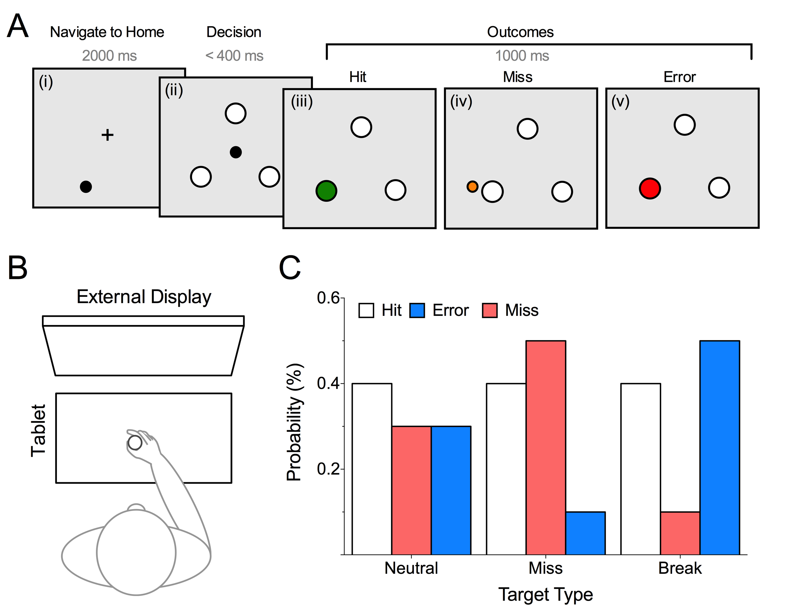

--- .class ##id  

## Behavioural Data

* Behavioural expereiment n = 21, Pilot tested 10 participants for EEG + 25 EEG experiment
* Pooling all gives n = 56 (and increasing)

 

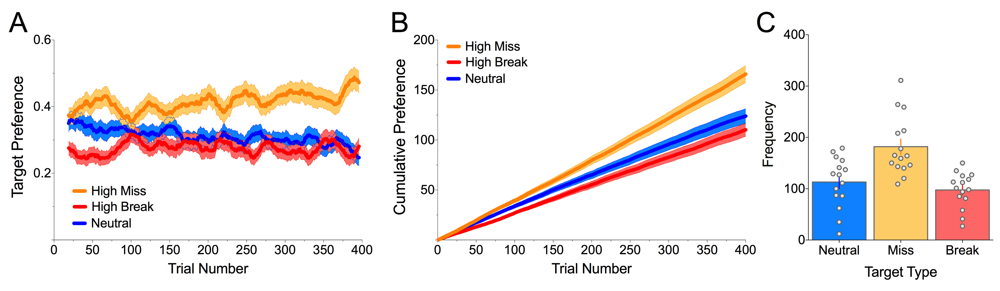

Figure 1: Systematic bias towards selecting miss targets- emerges early on

--- .class ##id  

## Behavioural Data contd.
* Also interested in the idea that sensorimotor competence modulates this effect
* Pilot tested with non-preferred hand (all right handers with EHI >80)

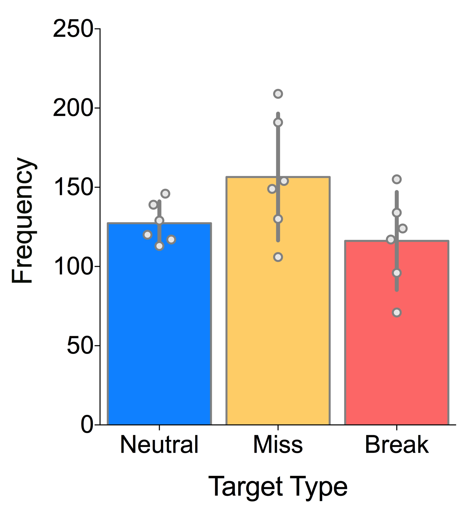

* Plan to run a within subjects design. Thoughts?

--- .class ##id  

## Feedback Related Negativity

* Central to this research is the examination of a putative neural correlate of reinforcement learning (RL), the feedback-related negativity (FRN). 

* This EEG event-related potential is characterised by a rapid (maximal 250-350ms post-feedback presentation) medial frontal negative deflection and is most likely generated by the anterior cingulate cortex (ACC). 

* The ACC has dense connections to regions responsible for sensorimotor control and reward processing, but understanding how these systems interact to evaluate outcomes is poorly understood. 

--- .class ##id 

## FRN and some early predictions

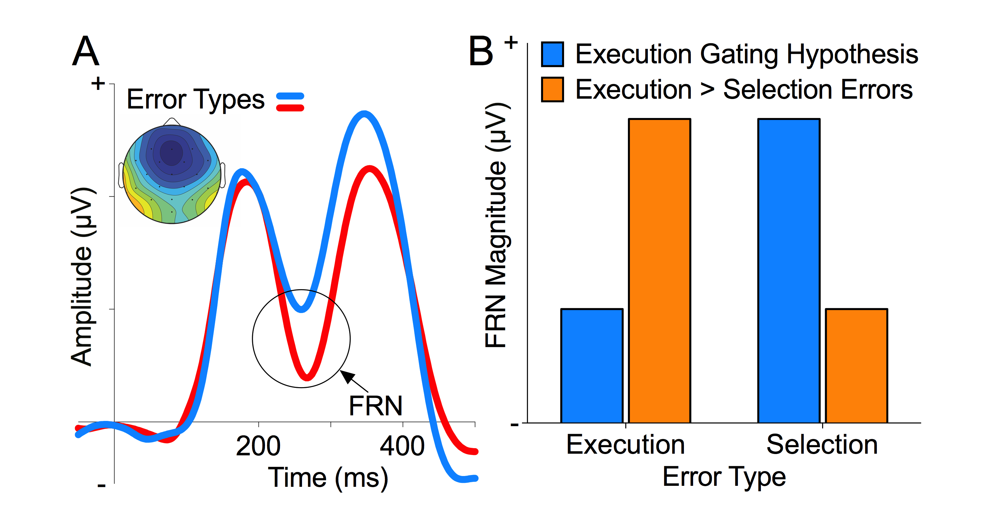

Fig. (A) The canonical FRN (inset shows topographical distribution of the component), adapted from Mushtaq et al. 2016: (B) A strong form of the Execution Gating Hypothesis predicts the FRN should be smaller in response to execution errors (blue). An alternative, where executions are weighted more heavily than selection, is represented in orange.

--- .class ##id 

## Grand Averaged ERPs per outcome

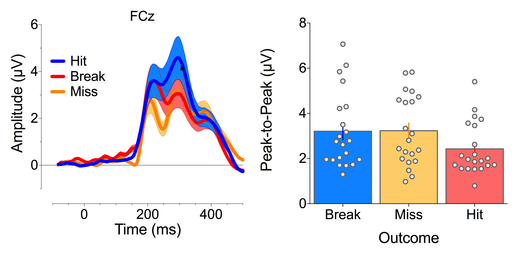

* statistically reliable differencesfrom ~200-300ms. also frontally distributed- where we would expect the FRN. 

> Rich: "In the hits, there is a slight flattening here but no negative dip.   The other two conditions show a negative dip. I don’t remember how we signal breaks but if symbolically (e.g., color), then I wonder if the earlier signal for misses
is because here there is a spatial signal of the error and this might be more salient than the symbolic cue. Beyond the latency lead, the break and miss signals look quite similar, eh?"

* peak-to-peak analysis shows that the miss and break have equivalent relative negativities

--- .class ##id  

## Outcomes/Target 

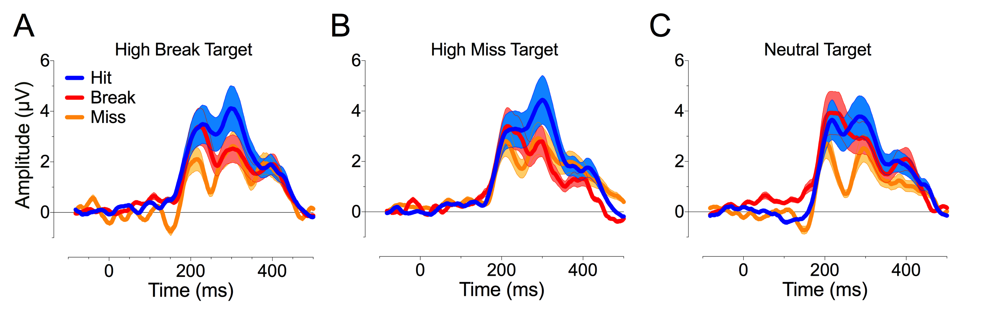

> Rich: Re neutral: Although a bit hard to see, the main effect here seems to be that Break FRN is attenuated in the Neutral case.  This would be puzzling if I am not misunderstanding neutral since neutral probability would be between high and low. Could you replot these data, with each panel for one type of outcome (miss, break, hit) and the three functions showing when the outcome was high, low, or neutral. This would be another way to see if the ERP to a particular
outcome varies as a function of probability.    

--- .class ##id  

## Targets/Outcome 

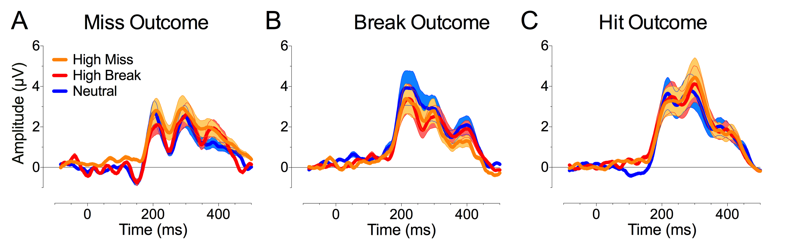

> Rich: the new figure reveals another curious result. for the miss trials, there is a downward swoop at around 130 ms for the high break and high miss conditions.
any thoughts on that?  it seems to be influencing the amplitude differences prior to the FRN. Not sure what to make of this, but FRN is largest for neutral in miss condition and smallest for neutral in break condition.
This is certainly at odds with a nice ordering based on probability within each condition.

> Faisal: We can see a similar pattern for the Hit target panel too. It's a very early negativity and I'm not sure why this is happening but I'm also not too convinced by these fluctuations - they don't show up as statistically significant when I run the mass univariate test and correct for false discovery rate (but I am being very conservative with my approach and could sensibly be more lenient here). it's something I need to investigate further. Currently running through the early vs late trials analysis so I'll get on to this later in the week. But as it stands, it's clear that there isn't just a main effect of probability. 

--- .class ##id  

## More- but not ready for prime time

* Inspired by the 2-armed bandit: an Interceptive timing version

* Manipulating feedback salience:

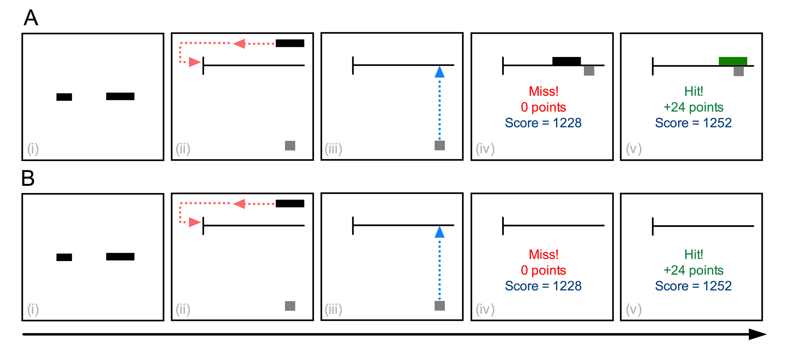

* (A) KP = Spatial; (B) KR = Binary

--- .class ##id  

## Interceptive timing results

* Conceptual replication: Consistent with the PNAS paper results- reduced risk aversion as feedback salience increases

* Veridical feedback

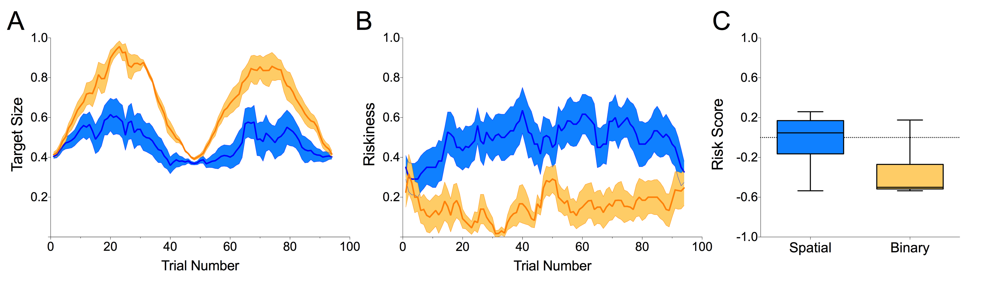

--- .class ##id  

## Interceptive timing results contd.

* Pseudoveridical feedback

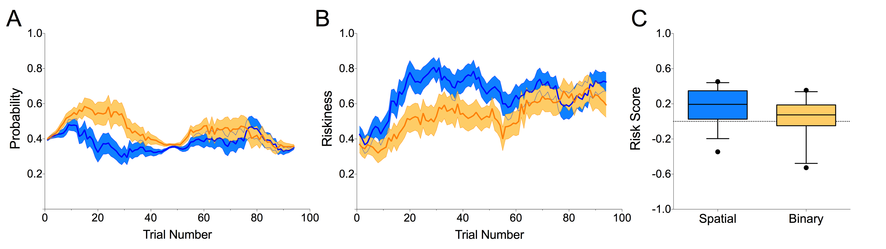

--- .class ##id  

## Interceptive timing results contd.

* Pseudoveridical feedback + switch feedback within subjects

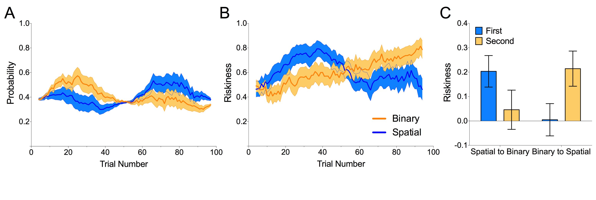

--- .class ##id  

## And finally...

* PhD student (Jack Brookes) has been playing around with a VR version of the 3-arm bandit

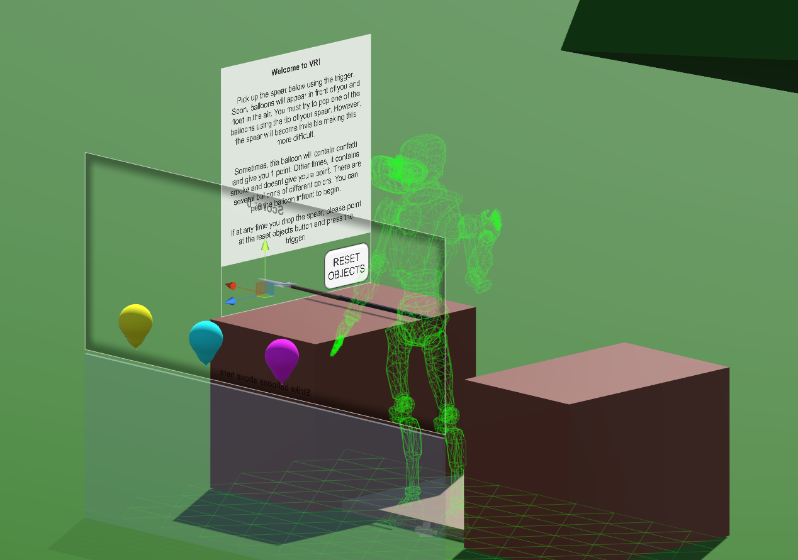

* Havent quite figured the right parameters balancing task difficulty and no data collected yet but is lots of fun!...
