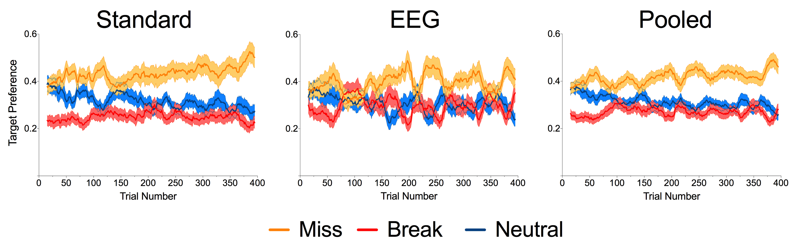
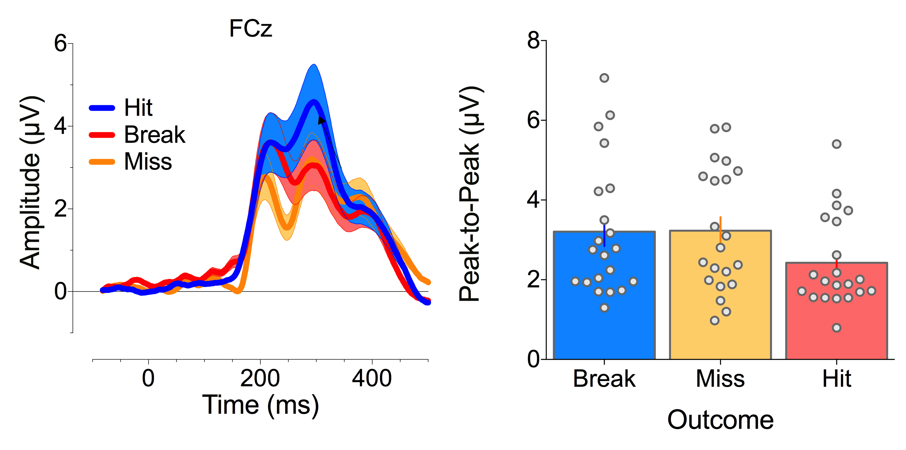

## Overview of to do (and done) list
* Breakdown of behavioural data
* Ran peak-to-peak analysis on FRN - done
* Early vs late phase analysis- focus on today
* Collect within subject (pref vs non pref hand) data - ongoing
* Export trial by trial data- on going- due early next week

--- .class ##id  

## Behavioural data

* Overall, EEG same pattern- but noisier

Figure 1: (A) Behavioural Only; (B) EEG; (C) Pooled

* Neutral > break difference (tukey's): Behavioural only p = .029*; EEG p = 0.9492; Pooled p = 0.07 

--- .class ##id  

## Behavioural Data: Dynamics

 

Figure 2: (A) Behavioural Only; (B) EEG; (C) Pooled. Shows filtered data of % (sum of each trial = 1)

--- .class ##id 

## Grand Averaged ERPs per outcome

* statistically reliable differencesfrom ~200-300ms. also frontally distributed- where we would expect the FRN

--- .class ##id  

## Peak to Peak FRN

* No difference when using a p2p measuring FRN
* peak positive amplitude between 150-250ms - peak negative amplitude between 250-350
* higher values inidcate larger FRN

--- .class ##id  

## Split by phase

* Separated trials into first and second 200 trials

--- .class ##id  

## Split by outcome

--- .class ##id  

## Peak to peak analysis

--- .class ##id  

## VR Experiment- Instruction Video

<iframe width="560" height="315" src="https://www.youtube.com/embed/U3RFrceKLio" frameborder="0" allowfullscreen></iframe>

* Credit Toby Waterman- Work Experience Student

--- .class ##id  

## VR Experiment- to do

* Adding end point indicator
* Adding tactile feedback - ongoing
* Still tweaking task difficulty parameters
* Data collection planned early July
